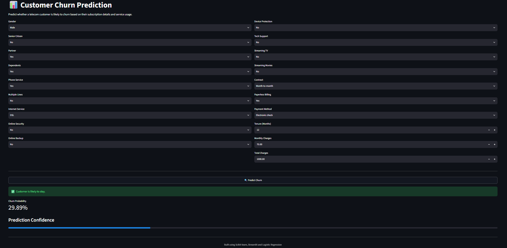

# 📊 Customer Churn Prediction

An end-to-end Machine Learning project that predicts whether a telecom customer is likely to churn based on customer demographics, subscription details, and service usage.

The project covers the complete ML workflow—from Exploratory Data Analysis (EDA) and model building to deployment using Streamlit.

## 📷 Application Preview




## 🎯 Problem Statement

Customer churn is one of the biggest challenges for subscription-based businesses.

The objective of this project is to build a machine learning model capable of predicting whether a customer is likely to leave the telecom service. Early identification of potential churners allows businesses to take proactive retention measures.


## 📂 Dataset

The project uses the IBM Telco Customer Churn dataset.

The dataset contains customer demographic information, subscribed services, account information, and the churn status of each customer.


## 🛠️ Tech Stack

- Python
- Pandas
- NumPy
- Scikit-learn
- Matplotlib
- Seaborn
- Streamlit
- Joblib

## 🔄 Project Workflow

1. Data Cleaning
2. Exploratory Data Analysis (EDA)
3. Feature Engineering
4. Data Preprocessing
   - One-Hot Encoding
   - Standard Scaling
5. Model Training
   - Logistic Regression
   - Decision Tree
   - Random Forest
6. Hyperparameter Tuning using GridSearchCV
7. Model Evaluation
8. Model Selection
9. Model Serialization using Joblib
10. Streamlit Deployment


## 📈 Key Insights from EDA

Some important observations from the analysis:

- Customers with month-to-month contracts had the highest churn.
- Customers using Fiber Optic internet showed significantly higher churn than DSL users.
- Electronic Check users churned more frequently than customers using automatic payment methods.
- Longer customer tenure was strongly associated with lower churn.
- Customers paying higher monthly charges showed relatively higher churn rates.


## 🤖 Models Evaluated

The following machine learning models were trained and compared:

- Logistic Regression
- Decision Tree Classifier
- Random Forest Classifier

Hyperparameter tuning was performed using GridSearchCV with 5-fold Cross Validation.


## 🏆 Final Model

After comparing multiple models, Logistic Regression was selected as the final production model.

Reasons:

- Highest Recall for churn prediction
- Best F1-score among the evaluated models
- Excellent ROC-AUC score
- Simple and interpretable
- Fast inference and easy deployment


## 📊 Final Results

| Metric | Score |
|---------|-------|
| Accuracy | 81% |
| Precision | 66% |
| Recall | 56% |
| F1 Score | 60% |
| ROC-AUC | 0.842 |


## 📁 Project Structure

```text
Customer_Churn_Prediction/
│
├── artifacts/
│   ├── logistic_model.pkl
│   └── preprocessor.pkl
│
├── data/
│   └── raw/
│       └── Telco-Customer-Churn.csv
│
├── notebooks/
│   └── Customer_Churn_Analysis.ipynb
│
├── src/
│   ├── __init__.py
│   └── predict.py
│
├── app.py
├── requirements.txt
├── README.md
└── .gitignore
```


## 🚀 Installation

Clone the repository

```bash
git clone https://github.com/DevendraRaj58/Customer-Churn-Prediction.git
```

Move into the project directory

```bash
cd Customer_Churn_Prediction
```

Install dependencies

```bash
pip install -r requirements.txt
```

Run the Streamlit application

```bash
streamlit run app.py
```


## 🔮 Next steps towards improvements

- Experiment with XGBoost and LightGBM.
- Handle class imbalance using SMOTE or class weighting.
- Add explainability using SHAP to interpret individual predictions.
- Build a REST API using FastAPI.


## 👨‍💻 Author

**Devendra Rajpurohit**

If you found this project interesting, feel free to connect with me on LinkedIn and explore my other repositories.

https://www.linkedin.com/in/devendraraj58/
https://www.kaggle.com/devendrarajpurohit58